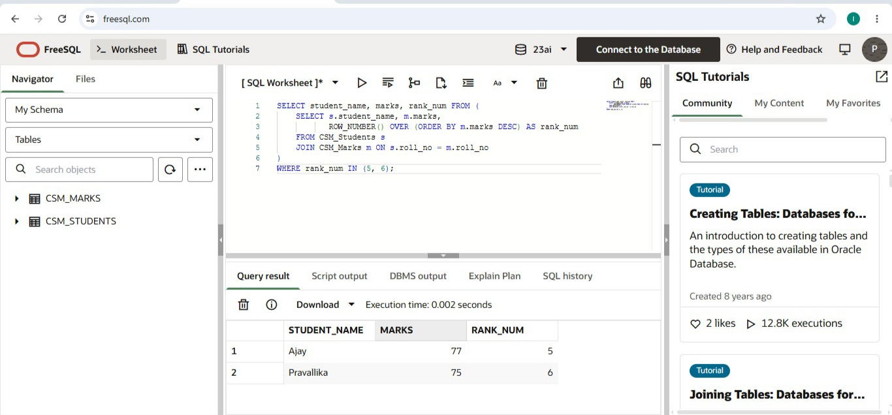
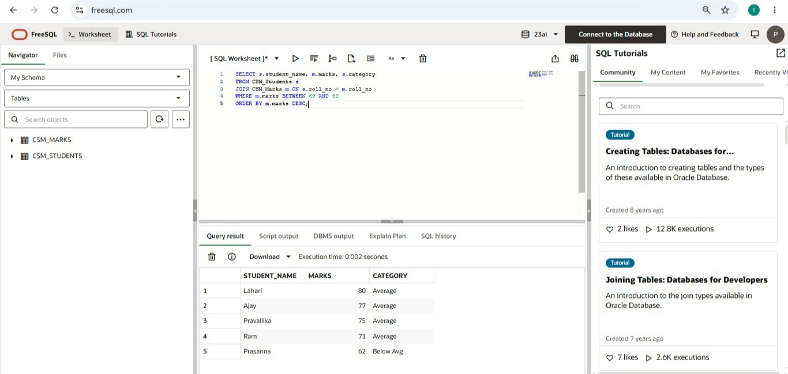
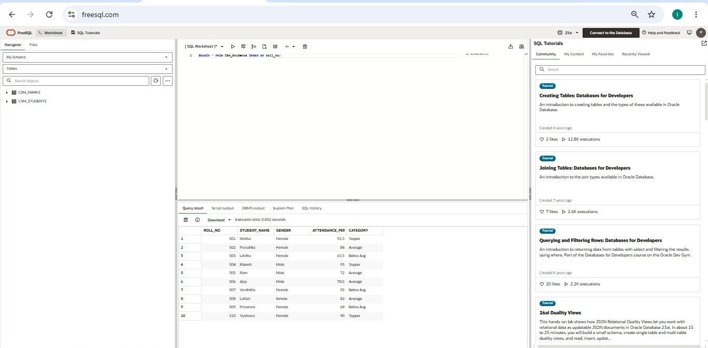
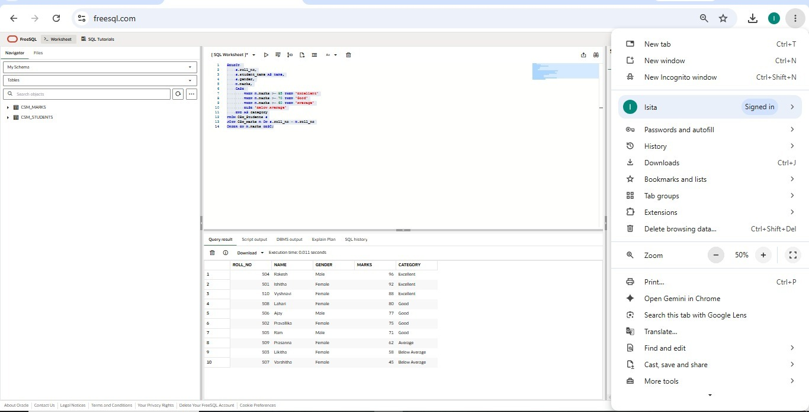

# SQL Student Performance Analysis

## 📊 Project Screenshots

### 1. Class Average

### 2. Students with Average Marks 60-80

### 3. Middle Rank Students

### 4. Final Table with Category

## ✅ Project Complete
